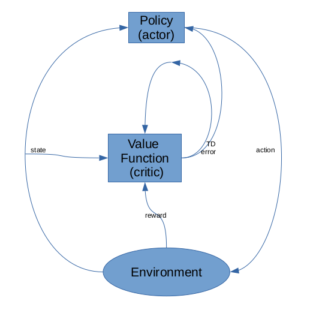
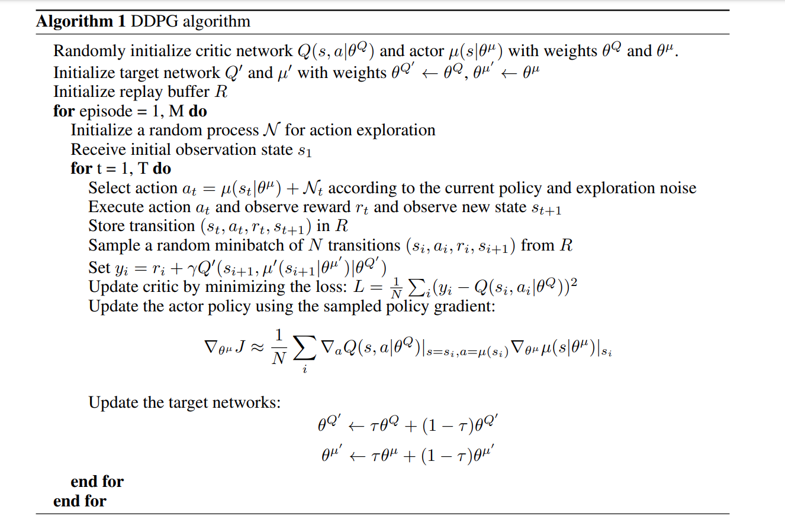
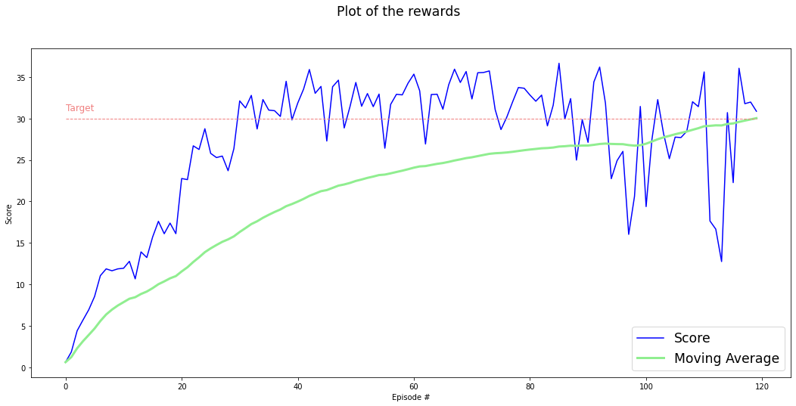
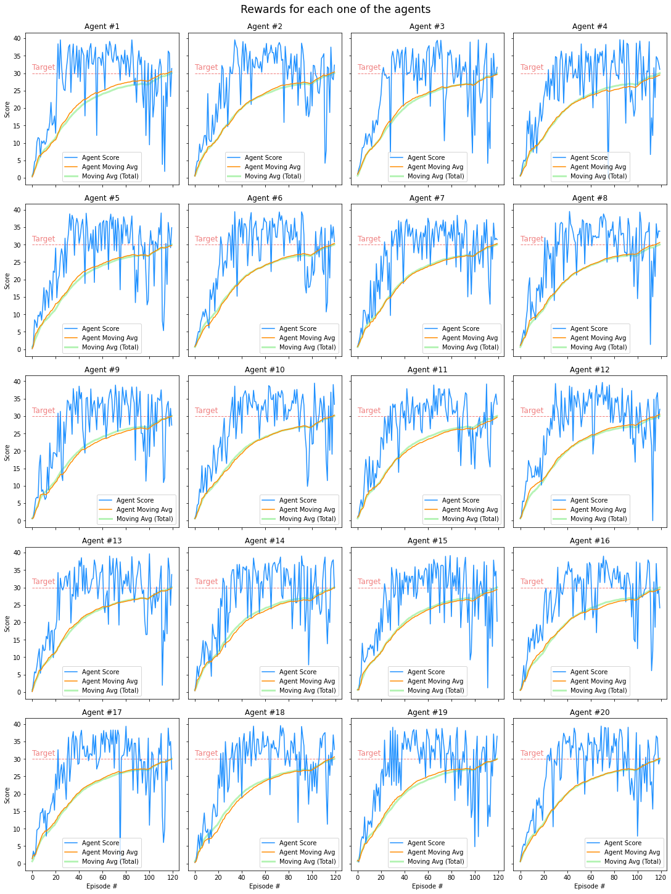

# DDPG for continuous control Task

In this project we have trained a  policy gradient reinforcement learning agent to solve a [continuous robotic control task](https://github.com/raminzohouri/DDGP-for-ArmRobot-Positioning/tree/maint#environment-details). 
In details, the environment built in 3D space and arm robot need to reach and remain in the target area from randomly initialized positions.
There are 4 action available for controlling the robot by apply torque to its joints. The measured stated contains position, rotation, velocity, and angular velocities of the arm. The task designed episodically and each episode last maximum of $1000$ cycles. Our solution uses a  policy gradient based reinforcement learning algorithm called [CONTINUOUS CONTROL WITH DEEP REINFORCEMENT LEARNING, DDPG](https://arxiv.org/pdf/1509.02971.pdf). The optimal policy should maximize its expected discounted reward $\mu^*(s)=\max_\pi \mathbb{E}[\sum_i \gamma^i r_i]$ by reaching and keeping the end effector of the arm robot in the moving target area. In addition to the vanilla DDPG algorithm we applied a few hyper parameter tuning techniques in order to solve the environment. In the following I will describe each step of our method in details and present the results. In this report the reference to the ideas and publications provide via hyper-link.

#### Solved Environment with 20 robots and starting from different positions. We reset the robot position when it has reached the target area.

## Learning Algorithm 

*  **Reinforcement Learning**:  is a type of machine learning method which tries to learn an appropriate closed-loop controller by simply interacting with the process and incrementally improving the control behavior. The goal of reinforcement learning algorithms is to maximize a numerical reward signal by discovering which control commands i.e. actions yield the most reward. Using reinforcement learning algorithms, a controller can be learned with only a small amount of prior knowledge of the process. Reinforcement learning aims at learning control policies for a system in situations where the training
  information is basically provided in terms of judging success or failure of the observed system behavior. 

* **Markov Decision Process**: The type of control problems we are trying to learn in this work are discrete time control problems and can be formulated as  a Markov decision process(MDP). An MDP has four components: a set $S$ of states, a set $A$ of actions, a stochastic transition probability function $p(s, a, s' )$  describing system behavior, and an immediate reward or cost function $c  : S × A → R$. The state of the system at time $t$, characterizes the current situation of the agent in the world, denoted by $s(t)$. The chosen action by agent at time step $t$ is denoted by $a(t)$. The immediate reward or cost is the consequence of the taken action and function of state and action. Since the rewards for the taken action can be formulated as cost, the goal of the control agent would be to find an optimal policy $π ∗ : S → A$ that minimizes the cumulated cost for all states. Basically, in reinforcement learning we
  try to choose actions over time to minimize/maximize the expected value of the total cost/reward.

* **Q-Learning**: In many real-world problems the state transition probabilities and the reward functions are not given explicitly. But, only a set of states $S$ and a set of actions $A$ are known and we have to learn the dynamic system behaviors by interacting with it. Methods of temporal differences such as Q-Learning were invented to perform learning and optimization in exactly these circumstances. The basic idea in Q-learning is to iteratively learn the value function, Q-function, that maps state-action pairs to expected optimal path costs. The goal of a Q-learning is to find optimal policy which returns highest expected reward give the action-value function. In order to find the optimal action in each state we use Bellman  optimality principal. By definition that means at each time step the optimal value of action in a particular state is equal sum its action-value and discounted reward collected after that time stamp onward. The update equation for the action-value function is : $Q(S_t , A_t )\leftarrow Q(S_t , A_t ) + \alpha[R_{t+1} + \gamma \max_a' Q(S_{t+1} , a') - Q(S_t , A_t)]$. 

* **On-policy** methods attempt to evaluate or improve the policy that is used to make decisions, whereas **off-policy** methods evaluate or improve a policy different from that used to generate the data. In **on-policy** control methods the policy is generally soft, meaning that $\pi(a|s) > 0$ for all $s \in S$ and all $a \in A(s)$, but gradually shifted closer and closer to a deterministic optimal policy. The on-policy approach in the preceding section is actually a compromise—it learns action values not for the optimal policy, but for a near-optimal policy that still explores.

* **Batch Reinforcement Learning**: At each time point $t$ it observes the environment state $s_t$ , takes an action $a_t$ , and receives feedbacks from the environment including next state $s_{t+1}$ and the instantaneous reward $r_t$. The sole information that we assume available to learn the problem is the one obtained from the observation of a certain number of one-step system transitions (from $t$ to $t + 1$). The agent interacts with the control system in the environment and gathers state transitions in a set of four-tuples $(s_t , a_t , r_t , s_{t+1 })$. Except for very special conditions, it is not possible to exactly determine an optimal control policy from a finites et of transition samples. Batch reinforcement learning aims at computing an approximation of such optimal policy $\pi^∗$, from a set of four-tuples: $D=[(s^l_{t}, a^l_{t} , r^l_{t} , s^l_{t+1}), l = 1,..., \#D]$.  This set could be generated by gathering samples corresponding to one single trajectory (or episode) as well as by considering several independently generated trajectories or multi-step episodes. Training algorithms with growing batch have two major benefits. First, from the interaction perspective, it is very similar to the ’pure’ online approach. Second, from the learning point of view, it is similar to an
  off-line approach that all the trajectory samples are used for training the algorithm. The main idea in growing batch is to alternate between phases of exploration, where a set of training examples is grown by interacting with the system, and phases of learning, where the whole batch of observations is used. The distribution of the state transitions in the provided batch must resemble the ’true’ transition probabilities of the system in order to allow the derivation of good policies. In practice, exploration cultivates the quality of learned policies by providing more variety in the distribution of the trajectory samples.

* **Policy Gradient Methods** learn a parameterized policy that can select actions without consulting a value function. A value function may still be used to learn the policy parameter, but is  not required for action selection. We use the notation $\theta \in \mathbb R^{d'}$ for the policy’s parameter vector. Thus we write $\pi(a|s, \theta) = Pr\{A_t = a | S_t = s, \theta_t =\theta\}$ for the probability that action a is taken at time $t$  given that the environment is in state s at time $t$ with parameter $\theta$. If a method uses a learned value function as well, then the value function’s weight vector is denoted $w \in \mathbb R^d$ as usual, as in $\hat{v}(s,w)$.  We use the gradient of some scaler value $J(\theta)$ with respect to policy parameters to learn the policy. The method aim to maximize the performance therefore the parameter updates uses the gradient ascent:  $ \theta_{t+1}=\theta_t + \alpha\widehat{\nabla J(\theta_t)}$, where $\widehat{\nabla J(\theta_t)}\in \mathbb R^d$ is a stochastic estimate whose expectation approximates the gradient  of the performance measure with respect to its argument $\theta_t$ . All methods that follow this general schema we call **policy gradient methods**, whether or not they also learn an approximate value function. Methods that learn approximations to both policy and value functions are often called **actor–critic methods**, where **‘actor’** is a reference to the learned policy, and **‘critic’** refers to the learned value function, usually a state-value function.

  * One advantage of parameterizing policies according to the soft-max in action preferences is that the approximate policy can approach a deterministic policy, whereas with $\epsilon-greedy$ action selection over action values there is always an $\epsilon$ probability of selecting a random action.
  * A second advantage of parameterizing policies according to the soft-max in action preferences is that it enables the selection of actions with arbitrary probabilities. In problems with significant function approximation, the best approximate policy may be stochastic.

* **Actor-Critic Method** we use state-value function to critic the actor function. Basically we use the state-value function to bootstrapping (updating  the value estimate for a state from the estimated values of subsequent states). This is a useful distinction, for only through bootstrapping do we introduce bias and an asymptotic dependence on the quality of the function approximation. The bias introduced through bootstrapping and reliance on the state representation is often beneficial because it reduces variance and accelerates learning. Actor-critic methods are TD methods that have a separate memory structure to explicitly represent the policy independent of the value function. The policy structure is known as the *actor*, because it is used to select actions, and the estimated value function is known as the *critic*, because it criticizes the actions made by the actor. Learning is always on-policy: the critic must learn about and critique whatever policy is currently being followed by the actor. The critique takes the form of a TD error. This scalar signal is the sole output of the critic and drives all learning in both actor and critic.

  ​                                                                                          

* **CONTINUOUS CONTROL WITH DEEP REINFORCEMENT LEARNING(DDGP)** while DQN solves problems with high-dimensional observation spaces, it can only handle discrete and low-dimensional action spaces. Many tasks of interest, most notably physical control tasks, have continuous (real valued) and high dimensional action spaces. DQN cannot be straightforwardly applied to continuous domains since it relies on a finding the action that maximizes the action-value function, which in the continuous valued case requires an iterative optimization process at every step. An obvious approach to adapting deep reinforcement learning methods such as DQN to continuous domains is to to simply discretize the action space. However, this has many limitations, most notably the curse of dimensionality: the number of actions increases exponentially with the number of degrees of freedom.  Such large action spaces are difficult to explore efficiently, and thus successfully training DQN-like networks in this context is likely intractable. Additionally, naive discretization of action spaces needlessly throws away information about the structure of the action domain, which may be essential for solving many problems. Here we combine the actor-critic approach with insights from the recent success of Deep Q Network (DQN). Prior to DQN, it was generally believed that learning value functions using large, non-linear function approximators was difficult and unstable. DQN is able to learn value functions using such function approximators in a stable and robust way due to two innovations: 1. the network is trained off-policy with samples from a replay buffer to minimize correlations between samples; 2. the network is trained with a target Q network to give consistent targets during temporal difference backups. It is not possible to straightforwardly apply Q-learning to continuous action spaces, because in continuous spaces finding the greedy policy requires an optimization of at at every timestep; this optimization is too slow to be practical with large, unconstrained function approximators and nontrivial action space. One challenge when using neural networks for reinforcement learning is that most optimization algorithms assume that the samples are independently and identically distributed. Obviously, when the samples are generated from exploring sequentially in an environment this assumption no longer holds. Additionally, to make efficient use of hardware optimizations, it is essential to learn in minibatches, rather than online. As in DQN, we used a replay buffer to address these issues. At each timestep the actor and critic are updated by sampling a minibatch uniformly from the buffer. Because DDPG is an off-policy algorithm, the replay buffer can be large, allowing the algorithm to benefit from learning across a set of uncorrelated transitions. 

  ​													 

  ​                              																				[source](https://arxiv.org/pdf/1509.02971.pdf) 

* **Improvements To DDPG**:

  * **batch normalization**: it is a method of adaptive re-parametrization, motivated by the difficulty of training very deep models. One of the key motivations for the development of BatchNorm was the reduction of so-called *internal covariate shift* (ICS). It is a mechanism that aims to stabilize the distribution (over a mini-batch) of inputs to a given network layer during training.  It provides an elegant way of re-parameterizing almost any deep network. The re-parametrization significantly reduces the problem of coordinating updates across many layers. To do that, we apply normalization using $\mu$ and $\sigma$ on activation of each hidden layer $H$ before applying nonlinear function: $H' = \frac{H-\mu}{\sigma}$     where      $\mu = \frac{1}{m}\sum_i H_i$,   and   $\sigma = \sqrt{\epsilon + \frac{1}{m}\sum_i(H_i-\mu)^2}$,  The major innovation of the batch normalization is that, it prevents the gradient from increasing the standard deviation or mean of $h_i$; the normalization operations remove the effect of such an action and zero out its component in the gradient. 

  * **Gradient Clipping**  One difficulty that arises with optimization of deep neural networks is that large parameter gradients can lead an SGD optimizer to update the parameters strongly into a region where the loss function is much greater, effectively undoing much of the work that was needed to get to the current solution. On the face of an extremely steep cliff structure, the gradient update step can move the parameters extremely far, usually jumping off of the cliff structure altogether **Gradient Clipping** clips the size of the gradients to ensure optimization performs more reasonably near sharp areas of the loss surface. It can be performed in a number of ways. The basic idea is to recall that the gradient does not specify the optimal step size, but only the optimal direction within an infinitesimal region. When the traditional gradient descent algorithm proposes to make a very large step, the gradient clipping heuristic intervenes to reduce the step size to be small enough that it is less likely to go outside the region where the gradient indicates the direction of approximately steepest descent. One option is to simply clip the parameter gradient element-wise before a parameter update. Another option is to clip the norm $||g||$ of the gradient g before a parameter update: $ {if}~||g||>v~then~g←\frac{g^v}{||g||}$  where $v$ is a norm threshold.

  * **Less aggressive policy update** in order to minimize the error and stabilize the policy the update the actor-critic network with less frequency, 10 times after each 20 step moves in environment.   

    

### The Experiment Setup :

* The robot get rewarded $+0.1$  for  each time step staying in the target area

* Each episode last maximum 1000 cycles or terminates earlier due to reaching terminal state

* The training stopped when agent has collected $30$ reward points averaged over past $100$ episodes.

* The hyper parameters are equal to the original DQN paper, the followings are changed(similar for all the variation of the algorithm we have tried):

  * gamma :  0.99              
  * actor_learning_rate : 0.001
  * critic_learning_rate: 0.001
  * update_every : 2 (for calculating loss)
  * $\tau$: 0.001 (soft update factor)
  * replay memory size: 100000
  * gradient clip norm: 1.0 (gradient clipping applied to all the algorithm variations)
  * batch size: 128
  * Hidden Unit Size: [400,300] (fully connected layers)
  * weight initialized to uniform distribution in range $(-0.003,0.003)$

### Results: 

* **DDPG** :  solves the task in the $120$ episodes. 

  

                                                       

* **DDPG score all agetns**:  

  

  

### Discussion and Future work: 

*  We managed to learn from multiple agents running in parallel and collecting samples to improve the policy. Clipping policy results, action, in the certain range could help agent to reach and stay in the target area. Usually applying large actions cause overshot and missing the target. 
*  As we could expect the adding batch normalization layer to the sequential feed forward neural network improves the performance due to regularization effect. During the training phase each batch of samples has its own mean and standard deviation, which effect distribution of the activation values. Batch normalization set mean of all activation to zero. 
* In the future in order to achieve high performance on each algorithm we could use [bayesian hyperparameter optimization](https://github.com/fmfn/BayesianOptimization) and search for some of the key parameters which increase the quality of the results. 
* Further improvement could be done on the critic network using variation of DQN algorithm:
  * [Noisy Network for Exploration](https://arxiv.org/abs/1706.10295) 
  * [Distributional DQN](https://arxiv.org/abs/1707.06887) 
  *  [multi-step bootstrap targets](https://arxiv.org/abs/1602.01783)
  * [Rainbow](https://arxiv.org/abs/1710.02298). 
*  Alternative to DDPG algorithm we could tryout following policy gradient methods:
   * [Trust Region Policy Optimization](https://arxiv.org/pdf/1502.05477.pdf)
   * [Proximal Policy Optimization Algorithms](https://arxiv.org/pdf/1707.06347.pdf)
   * [Q-PROP: SAMPLE-EFFICIENT POLICY GRADIENT WITH AN OFF-POLICY CRITIC](https://arxiv.org/pdf/1611.02247.pdf)
* To take one step further we could learn from raw pixels instead of the retrieved features. 

